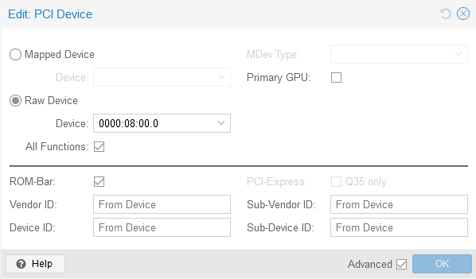

+++
title = 'Configuring GPU passthrough in Proxmox'
date = 2024-07-10T11:51:06Z
draft = true
tags = ['proxmox', 'linux', 'gpu']
+++


This document provides instructions for configuring GPU passthrough on a Proxmox host with an AMD Ryzen 9 3900X CPU and an NVIDIA RTX 3060 GPU. It covers:

- Preventing the nouveau and NVIDIA drivers from loading on the host by blacklisting them
- Passing through the GPU to a guest VM by configuring it as a raw PCI device with all functions enabled, without enabling it as the primary GPU
- Installing the NVIDIA drivers and utilities in the guest Ubuntu VM

The instructions aim to simplify the process of GPU passthrough, which is often overcomplicated in other guides.

Guides make this a lot more complicated than it is, for modern hardware at least.

AMD Ryzen 9 3900X
NVIDIA RTX 3060


# Host

## Prevent drivers loading
```bash
echo "blacklist nouveau" >> /etc/modprobe.d/blacklist.conf
echo "blacklist nvidia*" >> /etc/modprobe.d/blacklist.conf
```

# Guest
## Configure passthrough
Pass through PCI device as below
- Raw device
- All functions
- Don't enable Primary GPU



## Install drivers
- Install drivers
```
ubuntu-drivers install --gpgpu
```
- Install matching utilities
```
apt install nvidia-utils-535-server

```

## Install CUDA Toolkit
```bash
wget https://developer.download.nvidia.com/compute/cuda/repos/ubuntu2204/x86_64/cuda-ubuntu2204.pinsudo 
mv cuda-ubuntu2204.pin /etc/apt/preferences.d/cuda-repository-pin-600
wget https://developer.download.nvidia.com/compute/cuda/12.5.1/local_installers/cuda-repo-ubuntu2204-12-5-local_12.5.1-555.42.06-1_amd64.deb
sudo dpkg -i cuda-repo-ubuntu2204-12-5-local_12.5.1-555.42.06-1_amd64.deb
sudo cp /var/cuda-repo-ubuntu2204-12-5-local/cuda-*-keyring.gpg /usr/share/keyrings/
sudo apt-get updatesudo apt-get -y install cuda-toolkit-12-5
```

https://developer.nvidia.com/cuda-downloads?target_os=Linux&target_arch=x86_64&Distribution=Ubuntu&target_version=22.04&target_type=deb_local