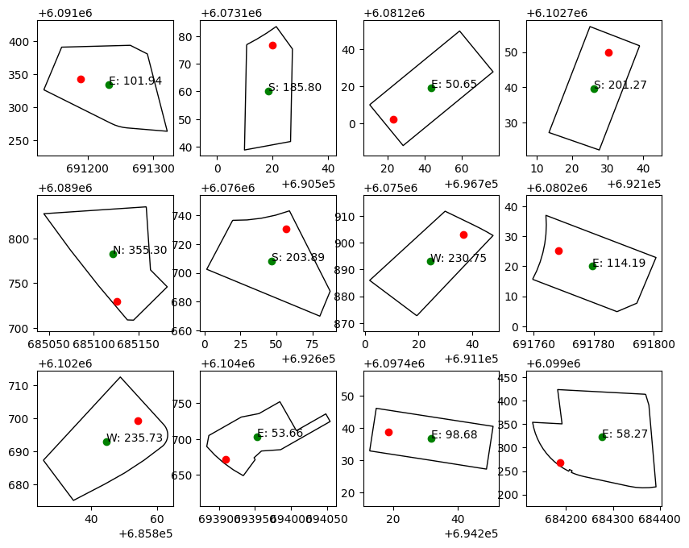

+++
title = 'Determining cardinal direction of land parcels'
date = 2024-06-18T12:09:25Z
draft = true
summary = 'Using open data to calculate cardinal direction of land parcels'
+++

We're looking to move to Canberra and so, have begun searching for a home to purchase. One of our requirements is a property with a north-facing backyard. 

Due to [axial tilt](https://en.wikipedia.org/wiki/Sun_path#Effect_of_the_Earth's_axial_tilt), properties with a north facing backyard receive more sunlight and are therefore better for growing.

Online real estate listings, if they contain any orientation information at all, usually do so as a [compass rose](https://en.wikipedia.org/wiki/Compass_rose) on a floorplan. This isn't very accessible to people or computers.

So, this lead me to the question:

>   Is there a way to programmatically determine block orientation?

Using open data, we can at least approximate the orientation of a land parcel

# Solution
## Data

+ [ACTGOV BLOCK CURRENT](https://actmapi-actgov.opendata.arcgis.com/datasets/ACTGOV::actgov-block-current/about)
+ [ACTGOV ADDRESSES](https://actmapi-actgov.opendata.arcgis.com/datasets/ACTGOV::actgov-addresses/about)

## Code
```python
import geopandas as gpd
import pandas as pd
```

### Load data files

```python
addresses_gdf = gpd.read_file(
    "data/ACTGOV_ADDRESSES_-460557821198955827.gpkg", engine="pyogrio"
)

blocks_gdf = gpd.read_file(
    "data/ACTGOV_BLOCK_CURRENT_3920010383705203761.gpkg", engine="pyogrio"
)
```
### Setup geometry columns
```python
addresses_gdf.set_geometry('geometry', crs="EPSG:7855", inplace=True)
blocks_gdf.set_geometry('geometry', crs="EPSG:7855", inplace=True)
```

### Drop unwanted columns
```python
addresses_gdf.drop([
    'GlobalID', 'CRC_ID'
], axis=1, inplace=True)

blocks_gdf.drop([
    'VOLUME_FOLIO', 'LAST_UPDATE', 'DEPOSITED_PLAN_NO', 'AP_NUMBER', 'BLOCK_TYPE_ID', 'DISTRICT_CODE', 'DIVISION_CODE', 'GlobalID'
], axis=1, inplace=True)

# Drop empty fields
blocks_gdf.drop([
    'STRATUM_LOWEST_LEVEL','STRATUM_HIGHEST_LEVEL', 'GROUND_LEVEL', 'BLOCK_KEY',
    'STRATUM_DATUM_ID', 'SENSITIVE_FLAG', 'TRANSITION_FLAG', 'WATER_FLAG' 
], axis=1, inplace=True)

```


### Normalise column names for the join
```python
blocks_gdf.rename({
    'BLOCK_NUMBER': 'BLOCK',
    'SECTION_NUMBER': 'SECTION',
    'DIVISION_NAME': 'DIVISION',
    'DISTRICT_NAME': 'DISTRICT'
}, axis=1, inplace=True)
```


### Join dataframes
```python
merged_gdf = addresses_gdf.merge(blocks_gdf, on=['DIVISION', 'DISTRICT', 'SECTION', 'BLOCK'])
```

### Rename data columns
```python
merged_gdf.rename({
    'geometry_x': 'address_geom',
    'geometry_y': 'block_geom'
}, axis=1, inplace=True)
```

### Drop any rows without an address
I.e. any land parcels without an address


```python
merged_gdf.dropna(subset='ADDRESSES', inplace=True)
```

### Calculate direction of backyard
1. Calculate the angle between two points:
    - The coordinate for the street address
    - The center of the land parcel geometry


2. Convert radians to degrees
3. As atan2 is a cartestian function, the angle is calculated counter-clockwise from the x-axis. To convert to cardinal coordinates:
    - Multiply by -1 to invert the rotation
    - Add 270 to rotate to '0 up'
    - Normalise to `0 >= angle < 360` by dividing by 360 and keeping the remainder

```python
import math
def calc_direction(row):
    radian = math.atan2(
        row['address_geom'].y - row['block_centroid'].y, 
        row['address_geom'].x - row['block_centroid'].x
    )
    degrees = math.degrees(radian)

    direction = (degrees * -1 + 270) % 360

    return direction

merged_gdf['block_centroid'] = merged_gdf['block_geom'].apply(lambda geom: geom.centroid)
merged_gdf['facing'] = merged_gdf.apply(calc_direction, axis=1)
```

### Add a convenience label
For this application, anything between North-West and North-East is considered North facing

```python
def direction(facing):
    if facing > 315 or facing <= 45:
        return 'N'
    elif facing > 45 and facing <= 135:
        return 'E'
    elif facing > 135 and facing <= 225:
        return 'S'
    elif facing > 225 and facing <= 315:
        return 'W'
    
merged_gdf['direction'] = merged_gdf['facing'].apply(direction)
```

```python
import matplotlib.pyplot as plt

rows = 3
cols = 4
plot_base = 10

sample_df = merged_gdf.sample(rows * cols)

sample_gdf = gpd.GeoDataFrame(sample_df)


# create figure and axes for Matplotlib
fig, ax = plt.subplots(rows, cols, figsize=(plot_base, math.ceil(plot_base * (rows / cols))))

for i in range(0 , sample_gdf.shape[0]):    
    subax = ax[math.floor(i / cols), i % cols]
    row = sample_gdf[i:i+1].copy().reset_index()

    subax.set_box_aspect(1)
    row.set_geometry('block_geom', inplace=True)
    row.plot(ax=subax, color="white", edgecolor='black')

    row.set_geometry('address_geom', inplace=True)
    row.plot(ax=subax, color='red')

    row.set_geometry('block_centroid', inplace=True)
    row.plot(ax=subax, color='green')

    subax.annotate(
        "%s: %.2f" % (row.at[0, 'direction'], row.at[0, 'facing']),
        xy=(row['block_centroid'].x, row['block_centroid'].y)
    )
```



## Known issues
* Corner blocks
* Odd shaped blocks
