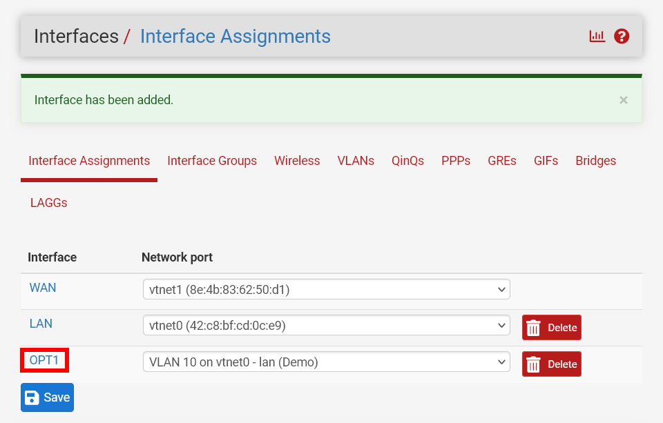
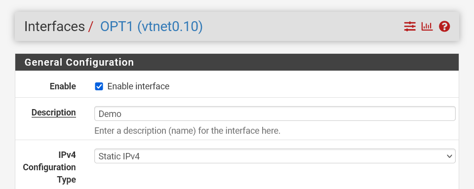
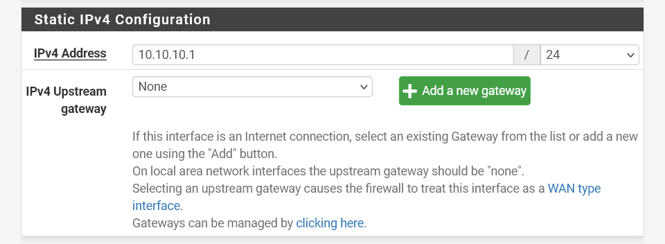
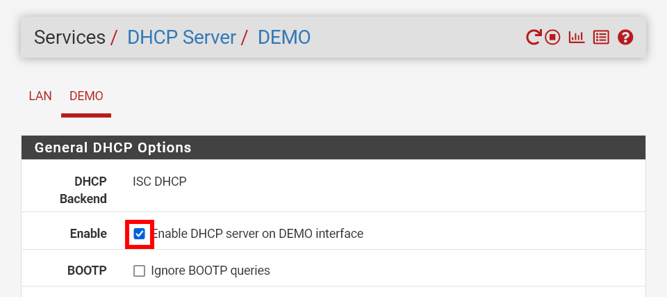
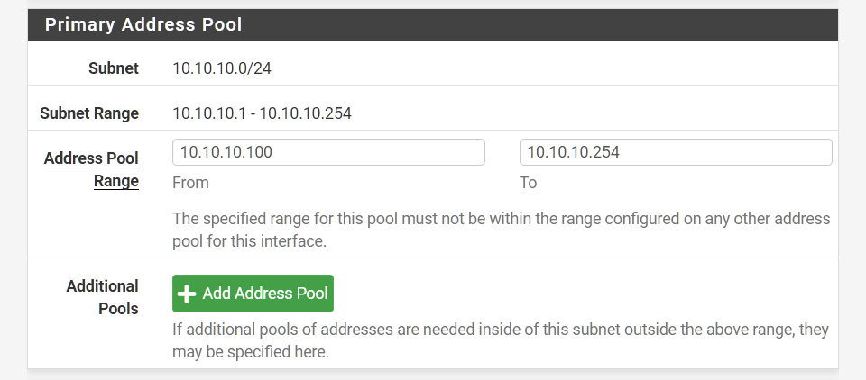

+++
title = 'Isolating VMs in Proxmox using VLANs'
date = 2023-11-20T10:00:35Z
draft = true
tags = [ 'proxmox', 'pfsense', 'networking' ]
+++

Proxmox + Pfsense are fantastic FOSS tools to run your own server virtualisation and home router. This tutorial adds VLAN tagging to an already existing Pfsense setup in a Proxmox managed VM.

VLAN presents a convenient way to isolate subnets for logical grouping and security. Some of the more common use cases for wanting to do this include:

- isolating home automation devices (smart lights, security cameras, etc.) from your personal devices,
- creating a separate network for Wi-Fi guests, or 
- segmenting a network to host a web server.

Thanks to Proxmox and Pfsense we can easily do this without requiring an expensive Layer 3 enterprise managed switch.

## Configuring proxmox

To use VLAN tagging in Proxmox we need to ensure our LAN bridge device is VLAN aware. This is a simple matter of ticking a checkbox on the interface.

[//]: # (screenshot of VLAN aware tag)

> You'll need to restart your Proxmox server for this change to take effect. Applying the configuration is not
> sufficient. 
{.important}

## Pfsense

~~Most~~ All the configuration work is done by PFSense. Using PFSense we can:

- assign [dynamic](#configuring-the-dhcp-server) and [static](#configuring-static-ip-assignments) IPs,
- [prevent one VLAN accessing another](#configuring-nat-rules),
- ensure we can still access VLAN from our network,
- allow access from WAN traffic

[//]: # (add note/link to Pfsense theme)

### Adding the interface

#### Add the VLAN interface
Navigate to `Interfaces -> Assignments -> VLANs` and add a new VLAN interface

The parent interface should be your LAN network (The same interface you made VLAN aware in Proxmox)

VLAN tag can be any value between 1 and 4094. Some devices default tag to 1, so it might be best to skip that. 

Give a meaningful description. Don't assume you'll remember that VLAN 10 was servers, VLAN 20 was cameras, etc. a year later.

#### Assigning the interface
You should now be able to add your newly created VLAN in Interface Assignments

This will add a new interface called `OPT1`

Click on the newly added interface to set some sensible values:

#### Configuring the interface

Under `General Configuration` set the following values
- Enable interface
- Set an appropriate name
- Set IPv4 configuration type to Static

Scroll down to `Static IPv4 configuration` to define an IP address for your VLAN

This can be a variant of any [private network](https://en.wikipedia.org/wiki/Private_network#Private_IPv4_addresses) address, as long as its different from your primary LAN.

I like using the `10.x.x.x/8` range. You won't need as many addresses as it allows, however you get flexibility to create naming conventions. 

As this is for VLAN 10, lets set the `IPv4 address` to `10.10.10.1/24` 

The `/24` subnet mask allows for 254 IP addresses on this VLAN. If you need more than this, I'm going to assume you don't need this article.

Be sure to save and apply changes before continuing.

### Configuring the DHCP server

Under `Services -> DHCP Server` you should now be able to enable DHCP for your VLAN interface

Scroll down to `Primary Address Pool`

You'll need to specify a range from which your DHCP server can assign addresses. Typically we leave some space for static IP assignments to avoid conflicting addresses.

If you don't care about static IP addresses you can start at `10.10.10.2` (we still need to make sure that we don't conflict with the interface IP!)

Save and Apply Changes

### Configuring NAT rules

- add nat rules

## Configuring your VM

Now that everything is set up, all you need to do is add a VLAN tag to the network device connected to the LAN bridge on
your VM.

> The subnet mask must be the same on the interface
{.important}

Reboot your VM and it should automatically pick up a an address as per the above DHCP configuration.

[//]: # (screenshot of ubuntu installer)

### Configuring static IP assignments

- configure static ipv4