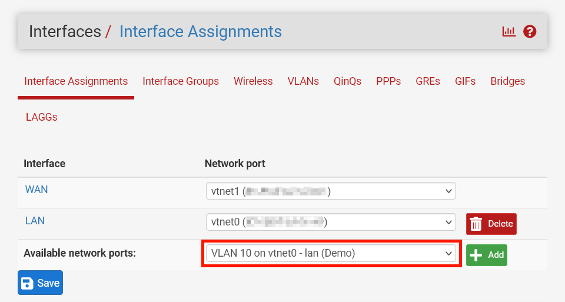

+++
title = 'Isolating VMs in Proxmox using VLANs'
date = 2023-11-20T10:00:35Z
draft = true
tags = [ 'proxmox', 'pfsense', 'networking' ]
+++

Proxmox + Pfsense are fantastic FOSS tools to run your own server virtualisation and home router. This tutorial adds VLAN tagging to an already existing Pfsense setup in a Proxmox managed VM.

VLAN presents a convenient way to isolate subnets for logical grouping and security. Some of the more common use cases for wanting to do this include:

- isolating home automation devices (smart lights, security cameras, etc.) from your personal devices,
- creating a separate network for Wi-Fi guests, or 
- segmenting a network to host web traffic.

Thanks to Proxmox and Pfsense we can easily do this without requiring an expensive Layer 3 enterprise managed switch.

## Configuring proxmox

To use VLAN tagging in Proxmox we need to ensure our LAN bridge device is VLAN aware. This is a simple matter of ticking a checkbox on the interface.

[//]: # (screenshot of VLAN aware tag)

> You'll need to restart your Proxmox server for this change to take effect. Applying the configuration is not
> sufficient. 
{.important}

## Pfsense

~~Most~~ All the configuration work is done by PFSense. Using PFSense we can:

- assign [dynamic](#configurating-the-dhcp-server) and [static](#configuring-static-ip-assignments) IPs,
- [prevent one VLAN accessing another](#configuring-nat-rules),
- ensure we can still access VLAN from our network,
- allow access from WAN traffic

[//]: # (add note/link to Pfsense theme)

### Adding the interface

#### Add the VLAN interface
Under Interfaces -> Assignments and add a VLAN

The parent interface should be your LAN network (The same interface you made VLAN aware in Proxmox)

VLAN tag can be any value between 1 and 4094. Some devices default tag to 1, so it might be best to skip that. 

Give a meaningful description. Don't assume you'll remember that VLAN 10 was servers, VLAN 20 was cameras, etc. a year later.

#### Adding the interface
Your newly created VLAN should now appear in your Interface Assignments

- add interface
- add interface assignment

### Configurating the DHCP server

- configure dhcp server for interface

### Configuring static IP assignments

- configure static ipv4

### Configuring NAT rules

- add nat rules

## Configuring your VM

Now that everything is set up, all you need to do is add a VLAN tag to the network device connected to the LAN bridge on
your VM.

Reboot your VM and it should automatically pick up a an address as per the above DHCP configuration.

[//]: # (screenshot of ubuntu installer)