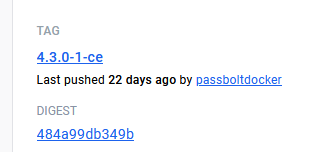

+++
title = 'Locally Testing Passbolt'
date = 2023-11-04T04:23:52Z
draft = true
summary = 'How to setup passbolt locally for upgrade testing'
tags = ['passbolt', 'docker']
+++

## Checkout passbolt project

Expand with docker-compose with mailpit example.

## Setting up your local test

### Retrieve data from production

#### Get a copy of the database
From the production database

##### Level 5

###### Level 6

```bash
sudo -i
cd /var/www_data/passbolt
docker exec -i passbolt-db-1 bash -c \
  'mysqldump -u${MYSQL_USER} -p${MYSQL_PASSWORD} ${MYSQL_DATABASE}' > \
  passbolt-20231102.sql
```

#### Get copy of the keys
```bash
docker cp passbolt-passbolt-1:/etc/passbolt/gpg/serverkey_private.asc \
  serverkey_private-<date>.asc
docker cp passbolt-passbolt-1:/etc/passbolt/gpg/serverkey.asc \
  serverkey-<date>.asc
```

#### Copy files locally
Use WinSCP / scp / etc.  You'll like need to give your login permissions
```bash
chown -R <username> serverkey*20231102.asc
```

## Copy to local passbolt project

### Setup .env

> The URL will need to be https:// and include port 9483 for local testing
{.note}

Copy `.env.local.example` to `.env`
Populate variables for local testing:
- `PASSBOLT_GPG_SERVER_KEY_FINGERPRINT` `<see-below>`
- `PASSBOLT_KEY_EMAIL` `<name@domain.com>`
- `SQL_DUMP_FILE` `<name-of-exported-prod-db-file.sql>`

#### Retrieving key fingerprint
```bash
sudo gpg --show-keys <public-serverkey.asc-from-before> | \
  grep -Ev "^(pub|sub|uid|$)" | tr -d ' '
```

### Update local hosts file
Update your local hosts file for the value you provided in `APP_FULL_BASE_URL`

### Create a local browser test
- Create a separate profile in Firefox/Chrome as testing will override your current Passbolt plugin configuration

## Performing an upgrade

### Updating local docker-compose
- Create new feature branch. I normally forward the email from Passbolt announcing a new version to the helpdesk so there is a ticket to reference
- Determine latest version from: https://hub.docker.com/r/passbolt/passbolt/tags
    - We want the latest tag that looks like `<major>.<minor>.<patch>-<build>-ce`

    

- Compare `docker-compose.yaml` to https://github.com/passbolt/passbolt_docker/blob/master/docker-compose/docker-compose-ce.yaml for version/configuration changes
    - The `env_file`, `${DB_PASSWORD}`, `APP_FULL_BASE_URL` and ports `9480:80` customisations are deliberate and required for our setup.
    - Most likely to change is the database version dependency

  ```docker
  db:
      image: mariadb:10.11
  ```

- Update Passbolt `image:` in `docker-compose.yaml` to tag above
  ```docker
  ...
  
  passbolt:
	  image: passbolt/passbolt-4.3.0-1-ce
	  
  ...
  ```


## Testing upgrade


### Cleanup first
If you've done an upgrade before, you'll need to remove all volumes so that it's truly a fresh install.


> This destroys all data without confirmation. Do not run anywhere else.
{.danger}

```bash
docker compose down -v
```

### Start passbolt
```bash
cd /path/to/passbolt/project
docker compose up -d
```

### Copy keys into container
```bash
cd /path/to/passbolt/project
docker cp serverkey_private-20231102.asc \
  passbolt-passbolt-1:/etc/passbolt/gpg/serverkey_private.asc
docker cp serverkey-20231102.asc \
  passbolt-passbolt-1:/etc/passbolt/gpg/serverkey.asc
```
#### Ensure permissions are set correctly
```bash
docker exec -it passbolt-passbolt-1 chown www-data:www-data \
  /etc/passbolt/gpg/serverkey.asc  
docker exec -it passbolt-passbolt-1 chown www-data:www-data \
  /etc/passbolt/gpg/serverkey_private.asc  
docker exec -it passbolt-passbolt-1 chmod 440 \
  /etc/passbolt/gpg/serverkey.asc  
docker exec -it passbolt-passbolt-1 chmod 440 \
  /etc/passbolt/gpg/serverkey_private.asc
```

### Start account recovery
- Navigate to `https://passbolt.dev.test:9480/recover` in the new browser profile
- Accept the unsecure local SSL certificate warning
- Provide email. This should be your email
- Open http://localhost:8025 to retrieve the email
- Click start recovery
- Download the extension
- Allow install
- Click Next on passbolt congratulations screen
- Supply your private key
- Enter your password
- Generate a new security token
- You should now be logged in

## Test new install
### From browser
- Edit a password and view it in plaintext
- Text search box
- Go to users and check group membership

### From command line
```bash
sudo -i
cd /path/to/passbolt/directory

## Start a shell in the docker container
docker exec -it passbolt-passbolt-1 /bin/bash

## inside docker terminal
## Start www-user shell
su -s /bin/bash www-data

## Check data integrity
./bin/cake passbolt datacheck --hide-success-details

## Check version is up-to-date
./bin/cake passbolt version
```


> If all this passes, we should be good to do the live upgrade
{.success}

## Clean-up files

```bash
## Delete containers and volumes
docker compose down -v
```
- Delete downloaded `*.asc` files
- Delete downloaded `*.sql` files
